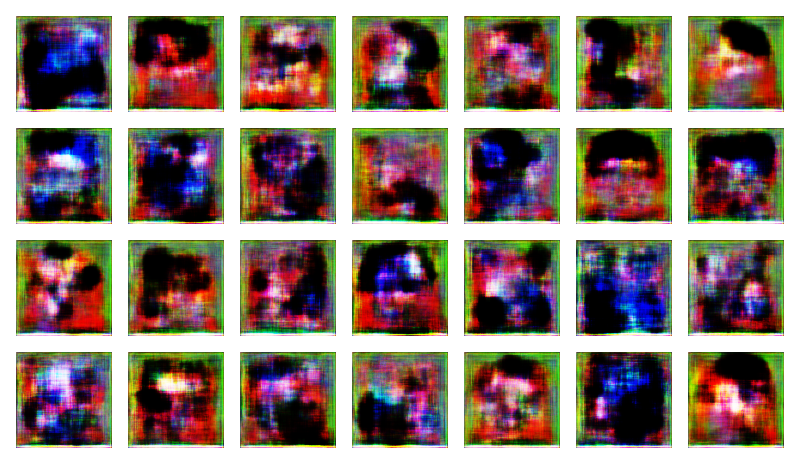
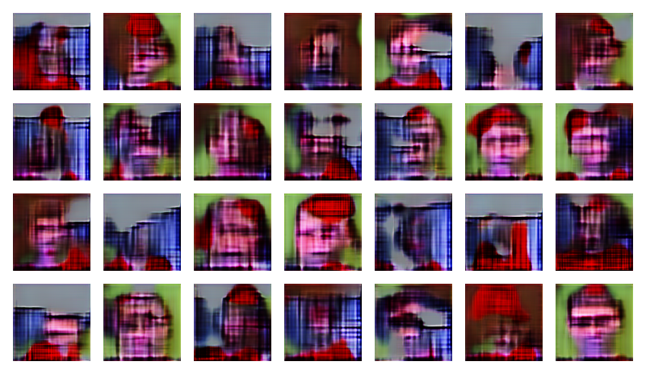

# Face-Generator-with-Generative-Adversarial-Networks
A fully explained approach on how to generate faces using GAN from scratch.

The project is developed using Tensorflow 2.0. to Implement a Generative Adversarial Network (GAN) from scratch in Python using TensorFlow and Keras.
Using two different Kaggle datasets that contain human face images, and Anime character faces, a GAN is trained that is able to generate human faces and Anime faces (soon).
The main aim is to understand all the concepts and functions required to train a GAN from basics.

The Jupyter notebook provided can be used to study the code in parts and understand what is happening at each stage, after each function and statement.
All explanations are written as comments in the code itself.

Currently the project is implemented with only 50 epochs and hence starting from this image as output;

This is what we get when we reach to the end of last epoch;

It does not seem to be a promising result at first, but with more epochs and and optimizations the ouputs will be improved and soon the project will be aimed to generate new Anime character images. 
